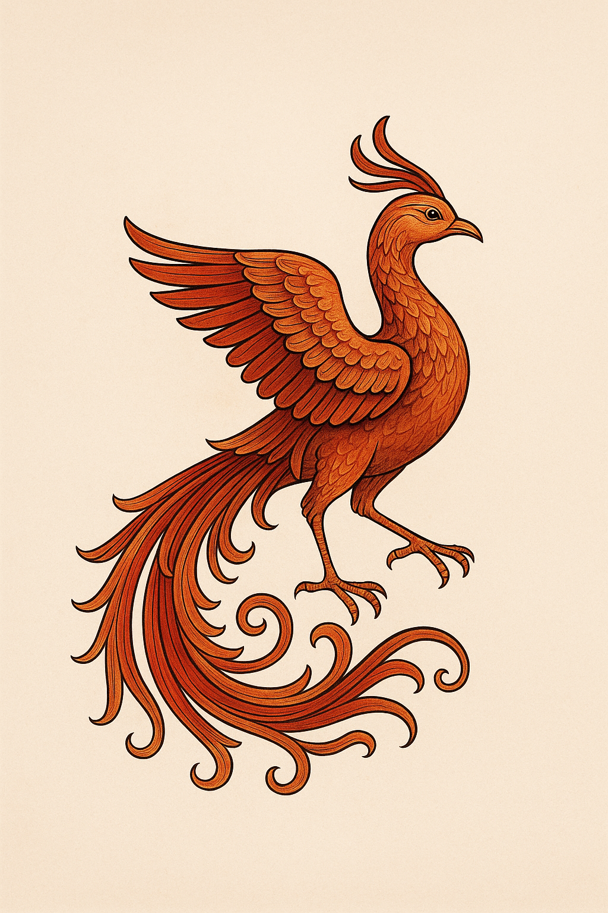

<div align="center">
  
  
  # Homa 🦅
  
  **The legendary bird that brings AI wisdom to Laravel.**
  
  [](https://github.com/falahatiali/homa/actions/workflows/tests.yml)
  [](https://github.com/falahatiali/homa/actions/workflows/code-quality.yml)
  [](https://packagist.org/packages/falahatiali/homa)
  [](https://packagist.org/packages/falahatiali/homa)
  [](https://packagist.org/packages/falahatiali/homa)
</div>

---

Homa is a simple and elegant AI assistant package for Laravel applications. Integrate multiple AI providers (OpenAI, Anthropic Claude, and more) with a clean, fluent API. Named after the mythical Persian bird that brings good fortune and wisdom to those it flies over.

## ✨ Features

- 🦅 **Simple, Fluent API** - Elegant interface inspired by Laravel's design philosophy
- 🔌 **Multiple AI Providers** - Support for OpenAI (GPT-4, GPT-3.5) and Anthropic (Claude)
- 💬 **Conversation Management** - Built-in context-aware multi-turn conversations
- ⚙️ **Highly Configurable** - Extensive configuration options for every use case
- 🧪 **Fully Tested** - Comprehensive test suite with CI/CD pipeline
- 📦 **Zero Configuration** - Works out of the box with sensible defaults
- 🎯 **Extensible** - Easy to add custom AI providers via Factory Pattern
- 🔒 **Type Safe** - Full PHP 8.1+ type hints and return types
- 🏗️ **SOLID Principles** - Clean architecture following best practices
- ⚡ **Production Ready** - Uses official OpenAI PHP client for reliability
- 🔍 **Code Quality** - PHPStan level 5 + Laravel Pint for consistency

## 📋 Requirements

- PHP 8.1 or higher
- Laravel 10.x or 11.x
- API keys for your chosen AI provider(s)

## 📦 Installation

Install the package via Composer:

```bash
composer require falahatiali/homa
```

### Publish Configuration (Optional)

```bash
php artisan vendor:publish --tag=homa-config
```

This will create a `config/homa.php` configuration file.

### Configure Your API Keys

Add your AI provider API keys to your `.env` file:

```env
# Choose your default provider (openai or anthropic)
HOMA_PROVIDER=openai

# OpenAI Configuration
OPENAI_API_KEY=your-openai-api-key
OPENAI_MODEL=gpt-4

# Anthropic Configuration  
ANTHROPIC_API_KEY=your-anthropic-api-key
ANTHROPIC_MODEL=claude-3-5-sonnet-20241022
```

## 🚀 Quick Start

### Basic Usage

Ask a simple question:

```php
use Homa\Facades\Homa;

$response = Homa::ask('What is Laravel?');
echo $response->content();
```

### Configure On-The-Fly

Chain configuration methods for custom behavior:

```php
$response = Homa::model('gpt-4')
    ->temperature(0.7)
    ->maxTokens(500)
    ->ask('Explain dependency injection in Laravel');

echo $response->content();
```

### Switch Between Providers

Easily switch between different AI providers:

```php
// Use OpenAI
$openaiResponse = Homa::provider('openai')
    ->model('gpt-4')
    ->ask('What is Laravel?');

// Use Anthropic Claude
$claudeResponse = Homa::provider('anthropic')
    ->model('claude-3-5-sonnet-20241022')
    ->ask('What is Laravel?');
```

### Custom System Prompts

Set custom system prompts for specialized behavior:

```php
$response = Homa::systemPrompt('You are a Laravel expert. Answer concisely.')
    ->ask('What is a service provider?');
```

### Multi-Turn Conversations

Create context-aware conversations:

```php
$conversation = Homa::startConversation();

$response1 = $conversation->ask('Hello! My name is Ali.');
// AI: Hello Ali! Nice to meet you...

$response2 = $conversation->ask('What is my name?');
// AI: Your name is Ali.

// Access conversation history
$history = $conversation->history();

// Clear conversation and start fresh
$conversation->clear();
```

### Advanced Chat Control

For full control over the conversation, use the `chat()` method:

```php
$messages = [
    ['role' => 'system', 'content' => 'You are a helpful Laravel assistant.'],
    ['role' => 'user', 'content' => 'What are service containers?'],
    ['role' => 'assistant', 'content' => 'Service containers are...'],
    ['role' => 'user', 'content' => 'Can you give me an example?'],
];

$response = Homa::chat($messages);
```

### Working with Responses

The `AIResponse` object provides several useful methods:

```php
$response = Homa::ask('Hello!');

// Get the response content
$content = $response->content();

// Get the model used
$model = $response->model();

// Get usage statistics (tokens, etc.)
$usage = $response->usage();

// Get raw API response
$raw = $response->raw();

// Convert to array
$array = $response->toArray();

// Convert to JSON
$json = $response->toJson();

// Use as string
echo $response; // Automatically calls content()
```

## ⚙️ Configuration

### Configuration File

After publishing the config file, you can customize all aspects in `config/homa.php`:

```php
return [
    // Default AI provider
    'default' => env('HOMA_PROVIDER', 'openai'),

    // Provider configurations
    'providers' => [
        'openai' => [
            'api_key' => env('OPENAI_API_KEY'),
            'api_url' => env('OPENAI_API_URL', 'https://api.openai.com/v1'),
            'model' => env('OPENAI_MODEL', 'gpt-4'),
            'temperature' => env('OPENAI_TEMPERATURE', 0.7),
            'max_tokens' => env('OPENAI_MAX_TOKENS', 1000),
            'timeout' => env('OPENAI_TIMEOUT', 30),
        ],
        'anthropic' => [
            'api_key' => env('ANTHROPIC_API_KEY'),
            'api_url' => env('ANTHROPIC_API_URL', 'https://api.anthropic.com/v1'),
            'model' => env('ANTHROPIC_MODEL', 'claude-3-5-sonnet-20241022'),
            'temperature' => env('ANTHROPIC_TEMPERATURE', 0.7),
            'max_tokens' => env('ANTHROPIC_MAX_TOKENS', 1000),
            'timeout' => env('ANTHROPIC_TIMEOUT', 30),
        ],
    ],

    // Default system prompt
    'system_prompt' => env('HOMA_SYSTEM_PROMPT', 'You are a helpful AI assistant.'),

    // Logging configuration
    'logging' => [
        'enabled' => env('HOMA_LOGGING', false),
        'channel' => env('HOMA_LOG_CHANNEL', 'stack'),
    ],

    // Caching configuration
    'cache' => [
        'enabled' => env('HOMA_CACHE_ENABLED', false),
        'ttl' => env('HOMA_CACHE_TTL', 3600),
        'prefix' => 'homa_',
    ],
];
```

### Available Models

**OpenAI:**
- `gpt-4` - Most capable, best for complex tasks
- `gpt-4-turbo-preview` - Faster GPT-4 variant
- `gpt-3.5-turbo` - Fast and cost-effective

**Anthropic:**
- `claude-3-5-sonnet-20241022` - Latest, most capable
- `claude-3-opus-20240229` - Most powerful for complex tasks
- `claude-3-sonnet-20240229` - Balanced performance
- `claude-3-haiku-20240307` - Fastest, most cost-effective

## 🎯 Use Cases

### Content Generation

```php
$blogPost = Homa::model('gpt-4')
    ->maxTokens(2000)
    ->ask('Write a blog post about Laravel best practices');
```

### Code Assistance

```php
$response = Homa::systemPrompt('You are an expert PHP developer.')
    ->ask('Review this code and suggest improvements: ' . $code);
```

### Customer Support Bot

```php
$conversation = Homa::systemPrompt('You are a helpful customer support agent.')
    ->startConversation();

$response = $conversation->ask($customerQuestion);
```

### Data Analysis

```php
$analysis = Homa::model('claude-3-5-sonnet-20241022')
    ->ask("Analyze this data and provide insights: " . json_encode($data));
```

## 🏗️ Architecture

### Package Structure

```
homa/
├── config/
│   └── homa.php                    # Configuration file
├── src/
│   ├── Contracts/
│   │   └── AIProviderInterface.php # Provider interface
│   ├── Conversation/
│   │   └── Conversation.php        # Conversation manager
│   ├── Exceptions/
│   │   ├── AIException.php         # Base exception
│   │   └── ConfigurationException.php
│   ├── Facades/
│   │   └── Homa.php                # Laravel facade
│   ├── Manager/
│   │   └── HomaManager.php         # Main manager class
│   ├── Providers/
│   │   ├── AnthropicProvider.php   # Anthropic implementation
│   │   └── OpenAIProvider.php      # OpenAI implementation
│   ├── Response/
│   │   └── AIResponse.php          # Response wrapper
│   └── HomaServiceProvider.php     # Laravel service provider
└── tests/                          # Comprehensive test suite
```

### Adding Custom Providers

You can extend Homa with custom AI providers by implementing the `AIProviderInterface`:

```php
use Homa\Contracts\AIProviderInterface;
use Homa\Response\AIResponse;

class CustomProvider implements AIProviderInterface
{
    public function sendMessage(array $messages, array $options = []): AIResponse
    {
        // Your implementation
    }
    
    // Implement other required methods...
}
```

## 🧪 Testing

Run the test suite:

```bash
composer test
```

Or with PHPUnit directly:

```bash
./vendor/bin/phpunit
```

## 🤝 Contributing

Contributions are welcome! Please feel free to submit a Pull Request.

1. Fork the repository
2. Create your feature branch (`git checkout -b feature/amazing-feature`)
3. Commit your changes (`git commit -m 'Add some amazing feature'`)
4. Push to the branch (`git push origin feature/amazing-feature`)
5. Open a Pull Request

## 📝 Changelog

Please see [CHANGELOG](CHANGELOG.md) for more information on what has changed recently.

## 🔒 Security

If you discover any security-related issues, please email the maintainer instead of using the issue tracker.

## 📄 License

The MIT License (MIT). Please see [License File](LICENSE.md) for more information.

## 🌟 Credits

- **Author**: [Ali Falahati](https://github.com/falahatiali)
- **Inspired by**: The mythical Persian Homa bird, a symbol of wisdom and good fortune

## 📖 About Homa

In Persian mythology, the **Homa** (also spelled Huma) is a legendary bird that brings good fortune and wisdom to those fortunate enough to be graced by its shadow. The bird is said to never land, continuously soaring through the skies, much like how this package aims to elevate your Laravel applications with the power of AI.

Just as the Homa bird is known for its wisdom and grace, this package strives to bring intelligent, elegant solutions to your AI integration needs, making it effortless to incorporate cutting-edge AI capabilities into your Laravel applications.

---

<div align="center">
  
  **May the wisdom of Homa guide your code!** 🦅
  
  Made with ❤️ for the Laravel community
  
</div>
